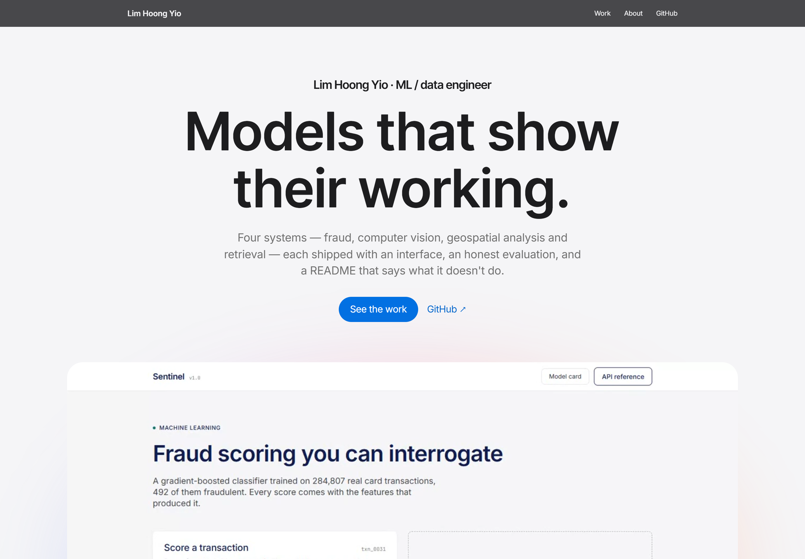
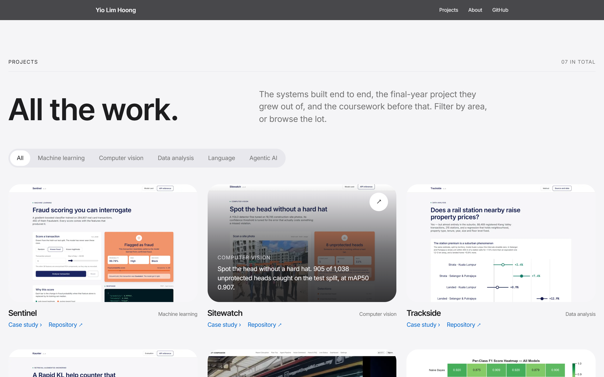
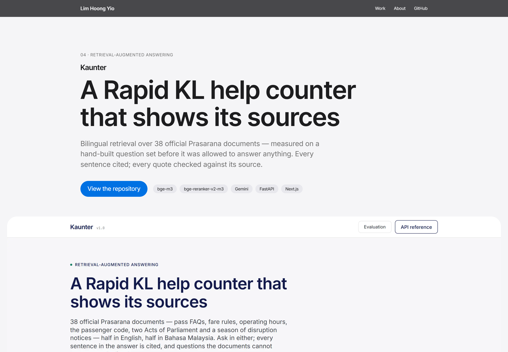

# Portfolio

**Live:** [portfolio-skymisty01.vercel.app](https://portfolio-skymisty01.vercel.app)

The site at the front of five projects — Sentinel, Sitewatch, Trackside, Kaunter and
Turnstile — each built, measured and documented before it was allowed on this page.



## What's on it

- **Home** — an introduction, a looping, muted montage of four of the apps recorded from the
  running software (no stock footage), the work in five numbers, a featured carousel that
  pages through the projects, and About — portrait, contact, then experience and
  certifications as spec-style rows, exactly as listed on LinkedIn (no role descriptions
  are invented).
- **All projects** (`/projects`) — everything in one place: a filter by area and a grid of
  tiles, the five systems alongside the final-year project they grew out of and the
  coursework before that. Hover a tile and it tells you what the project found.
- **One page per project** (`/projects/<slug>`) — the problem, the approach, the numbers,
  the decision worth explaining, and what it doesn't do. Every figure comes from that
  project's README; nothing on this site is quoted that wasn't measured there.





## Design

The Refero style reference **"Apple (España) — gallery vitrine in morning fog"**, kept in
[DESIGN.md](DESIGN.md): fog-grey canvas, near-monochrome, one blue reserved for the primary
action, Inter Tight display type at 56–96px standing in for SF Pro Display, 28px card radius,
pill buttons, no shadows, and whitespace as the only divider. The project interfaces
use a different system (Column) on purpose: the shopfront and the exhibits are not the same
object.

The hero montage is `public/hero.mp4` (28 s, 2.7 MB, h264). It was recorded with
`scripts/record.py`, which drives each app with Playwright, and stitched with ffmpeg
(`xfade`, 0.6 s). Re-record by starting a project's frontend on :3000 (and API on :8000) and
running `python scripts/record.py <sentinel|sitewatch|trackside|kaunter>`.

## Running it

```bash
npm install && npm run dev
```

Static export: every page is prerendered at build time. Content lives in `content/` —
`profile.ts` for the person, `projects.ts` for the five case studies and the supporting work
(each with a `group` that drives the filter on `/projects`), `experience.ts` for roles and
certifications.

Employer marks in `public/logos/` identify past employers and remain their trademarks; the
Allianz mark is the public-domain vector from Wikimedia Commons.

## Deploy

Vercel, framework preset Next.js, no environment variables.
